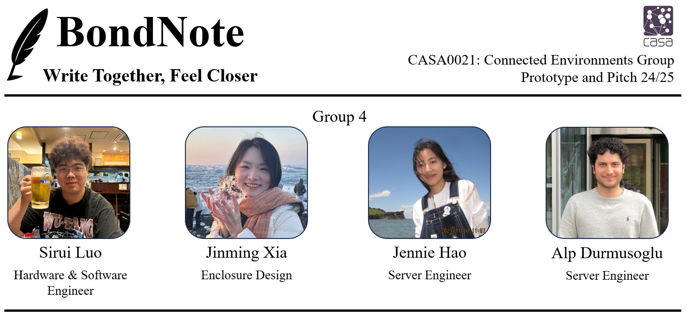

   

### Project Video:

  

# ✍️ Whats is BondNote?
BondNote is a connected handwriting device designed to restore emotional warmth to digital communication (Fig.1). The project realises real-time transmission and dynamic reproduction of handwritten content by connecting two physical handwriting tablets. Its core design concept is ‘Bring warmth back into communication - because some messages deserve more than just text’.

   
  <b>Fig.1</b> BondNote rendering picture

# 📑 Table of Contents

- [Why BondNote Is Useful](#-why-bondnote-is-useful)
- [Getting Started](#-getting-started)
- [How to use it](#-how-to-use-it)
- [Product Special Features](#-product-special-features)
- [Future Work](#-future-work)
- [Contributions](#-contributions)
- [Budget List](#-budget-list)
- [References](#references)

---

# 💡 Why BondNote Is Useful
<!-- 讲清楚使用场景、痛点与收益，展示价值主张。 -->
In today's digital world, the rapid development of technology has led to the gradual replacement of traditional handwriting by digital devices to dominate our conversations (Kiefer et al., 2015). Take WhatsApp, Messenger, and other popular instant messengers as an example, although they have greatly improved the efficiency of information transmission, they have become ‘flat’ because of their over-reliance on standardized text and emoticons. Different from the mechanical recognition of printed text, the writing and reading of handwritten text involve a complex process of linguistic and visual processing in the brain, and its personalized features carry emotional memory information (Ren et al., 2018).

In addition, the technology usability divide is particularly pronounced among specific groups. Pew Research Center (2017) found that 34% of older internet users say they have little to no confidence in their ability to use electronic devices to perform online tasks.
In the family scenario, parents often need to establish ‘lightweight’ remote communication with their younger children. However, existing solutions, such as equipping children with personal devices like smartphones, have many drawbacks. Children who are exposed to mobile phones early and excessively are more likely to have shortened attention spans, anxiety, and problems with social interactions (EdSource, 2024). Longcamp et al. (2005) showed that handwriting activities promote cognitive development by enhancing the perceptual-motor connection and helping children to better recognize and remember letters.

   
  <b>Fig.2</b> Target users

Therefore, we identified the target users of our product (Fig.2):
-  ***Long-distance companions*** : need strong emotional connection and companionship, not cold digital information.
- ***The elderly and children***: need a simple and intuitive interactive system.

---
# 🚀 Getting Started

## Hardware List

To build and run this project, you will need the following hardware:

| Item                                | Quantity | Description/Note                      |
|------------------------------------- |:--------:|---------------------------------------|
| **ESP32 DEVKITV1**                  | 1        | Main microcontroller board            |
| **4-inch LCD TFT Touch Display**     | 1        | ili9488 chip                          |
| **Buttons**                         | 2        | For user input                        |
| **WS2812 RGB LED Strip**            | 1        | Individually addressable LEDs         |
| **Power Supply**                    | 1        | For powering ESP32 and peripherals    |
| **BondNote PCB**                    | 1        | Or it could be replaced as breadboard in Fig.3 |
| **Jumper wires**                    | multiple | Female-female, male-female, as needed |

***ps***: The BondNote PCB's Gerber file is in this repository. If you want to use this please upload this to any of the EDA manufacturers for building.

## Setup Steps

**1. Wiring:**  

   
  <b>Fig.3</b> Wiring illustraion

   - Connect the ESP32 to the LCD display following the ili9488 pinout.
   - Attach the two buttons to available digital pins on the ESP32 (remember to use pull-down or pull-up resistors as needed).
   - Connect the WS2812 LED strip data line to a suitable ESP32 GPIO, and provide appropriate power (typically 5V).
   - Power your ESP32 and peripherals using the power supply and jumper wires.

**2. Software Installation & Flashing the Code:**  
   - Install the [Arduino IDE](https://www.arduino.cc/en/software) on your computer.
   - Add the ESP32 board package to your IDE.
   - Install the necessary libraries:
     - `TFT_eSPI` (for ili9488 display)
     - `Adafruit_NeoPixel` (for WS2812 LED strip)
     - Clone this repository and flash **Bond_Note/BondNote_Code/BondNote.ino** to the ESP32 board

---
# 🖥️ How to use it

   
  <b>Fig.4</b> Functions flowchart of BondNote

The internal software of **BondNote** integrates a variety of functions and UI interfaces to ensure a warm and intuitive user experience. Below is a summary of the major functionalities and button interactions:

## ✉️ Core Functions: Sending and Receiving

### 1. Sending Handwritten Messages
- **Workflow:**
  - When the user clicks the "Send" button on the main interface, they enter the handwriting editing page.
  - On this page, users can freely write their message.
  - There are two physical buttons on the right side of the device:
    - **Upper button:** Confirm and send the current handwritten message.
    - **Lower button:** Erase the current handwriting (clear the canvas).

### 2. Receiving and Viewing Messages
- **Workflow:**
  - The Receive page provides a functional UI for browsing message history.
  - Users can use the two physical buttons to **page up** or **page down** through historical messages.
  - Messages from different senders are marked by their user name and distinct color (e.g., Jennie's messages in yellow, Kimi's messages in green).
  - After selecting a message, clicking it enters the "Redrawing" page, where the original handwriting process is dynamically displayed on the screen, enhancing the sense of real-time interaction.

## 🌈 Light Strip Notification & Real-time Listening

- On the welcome page, the software uses a WebSocket Echo listening function (`client.poll`) to constantly check for new messages from the server.
- When a new message is detected:
  - The sender's information is retrieved.
  - The RGB LED strip changes from a rainbow effect to a **breathing light** corresponding to the sender's color (e.g., Jennie = yellow breathing light, Kimi = green breathing light).
  - This real-time color change visually alerts users that a new message has arrived and helps identify the sender at a glance.

## 🔘 Button Interaction Overview

| Page        | Upper Button Function      | Lower Button Function     |
|-------------|---------------------------|--------------------------|
| **Welcome** | No response               | No response              |
| **Send**    | Send message              | Erase handwriting        |
| **Receive** | Page up                   | Page down                |
| **Message Redrawing** | Exit to Home     | Exit to Home             |

# 🌟 Product Special Features

## 🛠️ Hardware
**PCB Design & Fabrication:**  

   
  <b>Fig.5</b> PCB schematic, wiring and material object

We used EasyEDA Professional Edition to finish principle diagram drawing and PCB wiring design, and employed JLC international contract manufacturing service for PCB board manufacturing. The PCB board adopted the mode of expansion board design, and ESP32 DEVKIT1 development board was placed on the top layer. Then, connections with various components were designed based on different sectors to realize clear module division and efficient layout arrangement (Fig.5). 

## 💻 Software
**Real-time Communication:**  
BondNote once utilized the MQTT protocol in the early-stage design. However, the connection mode of MQTT is more suitable for light-weight data transmission, and it is not applicable to high-frequency data interaction. It can hardly realize the product's core function, namely synchronous handwriting trace representation. We finally chose WebSocket protocol as the alternative solution. 
WebSocket protocol can establish a permanent channel for real-time communication between the client end and the server, which significantly improves the response speed of application programs. It has characteristics like stabler long connection, lower transmission delay, etc., and it is particularly suitable for handwriting data transmission with manifest demands for real-time interactions. In addition, WebSocket can also manage multiple concurrent client end connections, which is vital for products needing simultaneous interactions among multiple users like BondNote.

**MongoDB and Heroku cloud platform integration:**  
As a NoSQL database, MongoDB is good at processing structured and semi-structured data, and it can store message coordinates, time stamps and users' information. It is very suitable for BondNote handwriting data coordinate storage. It can also provide powerful inquiry function, efficient data organization and fast interactive retrieval for users. 
Heroku, a cloud platform-as-a-service (PaaS), hosts the backend API, providing the necessary infrastructure for scalability, ease of deployment, and maintenance-free operation. The API hosted on Heroku seamlessly bridges the WebSocket protocol with MongoDB, enabling real-time data transactions between users and the database. Using Heroku’s managed services reduces operational overhead, ensures high availability, and facilitates continuous integration and deployment (CI/CD) practices, making it an ideal solution for Bond Note's infrastructure requirements.

**Structured Data Management:**  
Since the RAM space of ESP32 is relatively small, with limited processing capacity, we gave up the idea of using graphic data and turned to use light-weight Json format (Fig.8) to store and transmit handwriting data. During the process of storage and transmission, data coordinates are organized through time sequences to generate various arrays, which should be traversed in succession to realize real-time handwriting trace representation and guarantee efficient transmission and quick reading of data. 

   
  <b>Fig.6</b> Json formatted data

**Handwriting Algorithm Optimization:**  
Since traditional eSPI library has poor ability of processing continuously handwriting traces, and the screen hardware's refresh rate is also limited, handwriting traces written by built-in functions in the library are always not ideal enough. Upon research, we found that Bezier curve algorithm can smoothly connect points with a short distance, thus significantly improving smoothness, while points with a long distance may be separated from integral handwriting through the dot painting function of eSPI.  The two can be combined to form a high-quality effect of handwriting (Fig.7). Moreover, this mode has lower computation loads, and there is basically no delay between writing and trace generation, which will not influence users' experience. 

   
  <b>Fig.7</b> Before-and-after comparison pictures of optimization

## 🧩 Model Design
BondNote’s enclosure was designed and modeled in SketchUp, undergoing multiple iterations to achieve a balance between function, emotional needs, and visual aesthetics. The initial design focused on portability and a slim profile, but as the project progressed, we wanted BondNote to stand out from ordinary electronic products and better express emotional warmth. Therefore, the enclosure was gradually redefined as a decorative ornament suitable for family spaces, endowing it with a sculptural sense to create a warmer atmosphere (Fig.8). 

   
  <b>Fig.8</b> The initial design and improvements

With continuous hardware upgrades, the enclosure was resized several times to ensure both comfortable handwriting and screen readability. The internal structure was also repeatedly refined to allow all components to remain stable while maintaining a glue-free assembly, making it easier to maintain and more environmentally friendly (Fig.9).

   
  <b>Fig.9</b> Size, internal structure and placement angle adjustment

 To further enhance the user experience, we introduced an inclined placement angle, improving both the ergonomics of handwriting and the clarity of displayed content in different scenarios. The design of the light slot was inspired by desk lamps: the original exposed light bar was upgraded into a concealed, soft-light band to better convey warmth. We explored different materials and surface treatments—such as using sandpaper for a diffused lighting effect—based on both our experiments and professors’ advice, ultimately achieving a gentle ambient glow (Fig.10). 

   
  <b>Fig.10</b> Light slot design optimization

---

# 🔮 Future Work

## 3.1 Hardware Upgrade
In the future, we will consider customized and professional PCB production with a high degree of integration to lower costs and improve products' reliability. We will also establish long-term and stable cooperative relations with suppliers to guarantee the security of components' supply chains.

## 3.2 Software Function Expansion
We plan to provide more writing colors and the function of customization, develop mobile-end supporting App for BondNote, and provide functions like equipment initialization, monitoring and management to further improve users' experience.

## 3.3 Enclosure Improvement
In the future, the current PLA enclosure printed based on 3D printing technology may be upgraded as wooden materials to better reflect the product's feature of warm emotions and improve the product's market attraction and texture. 

---

# 🙌 Contributions

- **Sirui Luo:** Hardware selection, circuit construction, PCB design and manufacturing, all software development and deployment, as well as the script, filming, and editing of the project video. Readme file integration.
- **Jiniming Xia:** Enclosure design, manufacturing, and iteration. Project report integration.
- **Jennie Hao:** Server selection and setup, background research, and business analysis.
- **Alp Durmusoglu:** Node.js server code development and MongoDB server setup and maintenance.

---

# 💰 Budget List

| Item                                | Quantity | Price     |
|--------------------------------------|:--------:|:---------:|
| **ESP32 DEVKITV1**                  | 1        | £7        |
| **4-inch LCD TFT Touch Display**     | 1        | £22       |
| **Buttons**                         | 2        | £2.8      |
| **WS2812 RGB LED Strip**            | 1        | £11       |
| **BondNote PCB / Breadboard**        | 1        | £1         |
| **Jumper wires**                    | multiple | £1         |
| **3D Printed Enclosure**            | 1        | ≈£5       |
| **Total**                           | —        | **≈£49.8**|

 
PS：We need to deploy a server using Heroku, $5 for 1000 dyno hours/month

---

# 📑References

EdSource (2024) Excessive cell phone use can harm children. Here’s how parents can limit use at home. Available at: https://edsource.org/2024/excessive-cell-phone-use-can-harm-children-heres-how-parents-can-limit-use-at-home/718105 (Accessed: 24 April 2025).

Longcamp, M., Zerbato-Poudou, M.-T. & Velay, J.-L. (2005) The influence of writing practice on letter recognition in preschool children: A comparison between handwriting and typing. Acta Psychologica. 119 (1), 67–79. doi:10.1016/j.actpsy.2004.10.019.

Kiefer, M., Schuler, S., Mayer, C., Trumpp, N.M., Hille, K. & Sachse, S. (2015) Handwriting or Typewriting? The Influence of Penor Keyboard-Based Writing Training on Reading and Writing Performance in Preschool Children. Advances in Cognitive Psychology. 11, 136–146. doi:10.5709/acp-0178-7.

Pew Research Center (2017) Tech adoption climbs among older adults. Available at: https://www.pewresearch.org/internet/2017/05/17/tech-adoption-climbs-among-older-adults/ (Accessed: 24 April 2025).

Ren, X. Q., Fang, X., Sui, X. & Wu, Y. (2018) Characteristics and neural mechanisms of handwritten character recognition. Advances in Psychological Science, 26(7), 1174-1185. doi:10.3724/SP.J.1042.2018.01174

